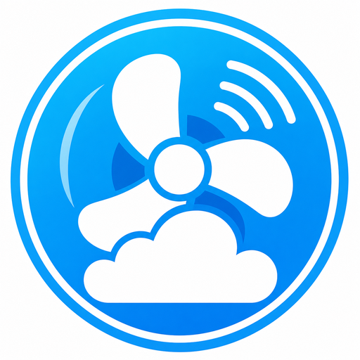

# ioBroker.dreo-cloud

[](https://www.npmjs.com/package/iobroker.dreo-cloud)
[](https://www.npmjs.com/package/iobroker.dreo-cloud)


[](https://nodei.co/npm/iobroker.dreo-cloud/)

**Tests:** 

## DREO Cloud adapter for ioBroker

Unofficial ioBroker adapter for selected DREO cloud-connected smart home devices.

> This project is not affiliated with, endorsed by, or supported by DREO.

## Current status

This adapter is under active development and currently intended for testing.

Implemented functionality includes:

- device discovery through the DREO FamilyTree
- runtime discovery of newly available devices
- live state updates through the DREO WebSocket connection
- automatic creation of device, information, raw, and friendly states
- read-only visibility for previously unknown raw states
- bidirectional control of supported functions
- automatic re-login and WebSocket reconnect after renewed DREO sessions
- effective friendly on/off states while preserving the original raw device state

The adapter uses the public TypeScript SDK:

```text
@mehrwiedu/dreo-api
```

DREO-specific command and dependency logic remains inside the SDK. The ioBroker adapter acts as the integration layer.

## Tested devices

| Model        | Device type | Tested quantity | Tested functionality                                                                         |
| ------------ | ----------- | --------------: | -------------------------------------------------------------------------------------------- |
| `DR-HCF007S` | Ceiling fan |               3 | Power, fan, speed, main light, brightness, color temperature, atmosphere light, live updates |
| `DR-HPF002S` | Stand fan   |               1 | Power, fan, speed, display state, live updates                                               |
| `DR-HHM001S` | Humidifier  |               1 | Discovery, raw states, power, timers, live updates                                           |

Other DREO devices may be discovered and exposed through raw states, but they are not automatically considered fully supported.

## Important account setup

The adapter currently requires a separate DREO account created with an email address and password.

1. Keep the devices and home assigned to the primary DREO account.
2. Create a second DREO account using email and password login.
3. Share the DREO home from the primary account with the second account.
4. Enter the credentials of the second account in the adapter configuration.

This setup is required because discovery uses the FamilyTree visible to the invited account.

Accounts that can only sign in through Apple or Google are currently not supported.

## Configuration

Configure the adapter instance with:

- DREO email address
- DREO password
- cloud region:
    - EU
    - US

The password is stored as an encrypted and protected ioBroker native setting.

## Object structure

Each discovered device is exposed below:

```text
dreo-cloud.0.devices.<deviceId>
```

Depending on the device and its supported states, the tree can include:

```text
info
power
fan
light.main
light.atmosphere
display
settings
timer
raw
```

The `raw` branch mirrors the original DREO state as closely as possible and is read-only.

Friendly states provide user-oriented names and effective operating states. For example, a fan can retain `raw.fanon=true` while the device is powered off. In that case, the friendly `fan.on` state is shown as `false` until power is enabled again.

## Supported controls

Where supported by the device, writable friendly states currently include:

```text
power.on
fan.on
fan.speed
light.main.on
light.main.brightness
light.main.colorTemperature
display.on
light.atmosphere.on
light.atmosphere.brightness
```

Changing a level can automatically activate its related function and the device power. This dependency logic is handled by the SDK.

## Installation

The adapter is not yet part of the official ioBroker repository.

For testing, it can be installed from GitHub after the repository has been published:

```text
https://github.com/mehrwiedu/ioBroker.dreo-cloud
```

## Cloud dependency

This adapter communicates with DREO cloud services and does not provide local-only control.

## Privacy and security

- Device data and commands are exchanged through the DREO cloud.
- Use a dedicated secondary DREO account for the adapter.
- Do not publish credentials, access tokens, device serial numbers, or unredacted diagnostic logs.
- Review logs before attaching them to issues.

## Known limitations

- Apple and Google login are not supported.
- Only EU and US regions are currently available.
- Not every raw DREO state has a friendly mapping.
- Timer, schedule, oscillation, RGB effects, presets, and model-specific modes may be incomplete.
- The humidifier currently has only the friendly mappings already validated in the adapter.
- Newly discovered devices may initially expose mostly raw states until their functions are verified.

## Development

Requirements:

- Node.js 22 or newer
- npm

Install dependencies:

```bash
npm install
```

Run the checks:

```bash
npm run check
npm run build
npm test
npm run lint
```

Test the adapter with dev-server:

```bash
npm run dev-server -- watch default
```

## Changelog

<!--
	Placeholder for the next version (at the beginning of the line):
	### **WORK IN PROGRESS**
-->

### **WORK IN PROGRESS**

- (mehrwiedu) Creator-based ioBroker adapter structure
- (mehrwiedu) FamilyTree-based device discovery
- (mehrwiedu) runtime discovery for newly available devices
- (mehrwiedu) live raw and friendly state synchronization
- (mehrwiedu) writable fan, power, and light controls
- (mehrwiedu) dynamic read-only creation of unknown raw states
- (mehrwiedu) automatic session renewal and WebSocket reconnect

## License

MIT License

Copyright (c) 2026 mehrwiedu <david@vonderhoeh.net>

Permission is hereby granted, free of charge, to any person obtaining a copy
of this software and associated documentation files (the "Software"), to deal
in the Software without restriction, including without limitation the rights
to use, copy, modify, merge, publish, distribute, sublicense, and/or sell
copies of the Software, and to permit persons to whom the Software is
furnished to do so, subject to the following conditions:

The above copyright notice and this permission notice shall be included in all
copies or substantial portions of the Software.

THE SOFTWARE IS PROVIDED "AS IS", WITHOUT WARRANTY OF ANY KIND, EXPRESS OR
IMPLIED, INCLUDING BUT NOT LIMITED TO THE WARRANTIES OF MERCHANTABILITY,
FITNESS FOR A PARTICULAR PURPOSE AND NONINFRINGEMENT. IN NO EVENT SHALL THE
AUTHORS OR COPYRIGHT HOLDERS BE LIABLE FOR ANY CLAIM, DAMAGES OR OTHER
LIABILITY, WHETHER IN AN ACTION OF CONTRACT, TORT OR OTHERWISE, ARISING FROM,
OUT OF OR IN CONNECTION WITH THE SOFTWARE OR THE USE OR OTHER DEALINGS IN THE
SOFTWARE.
