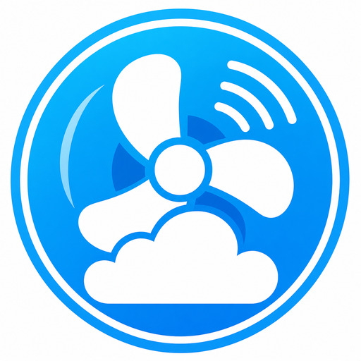

# ioBroker.dreo-cloud

[](https://www.npmjs.com/package/iobroker.dreo-cloud)
[](https://www.npmjs.com/package/iobroker.dreo-cloud)


**Tests:** 

## DREO Cloud adapter for ioBroker

Unofficial ioBroker adapter for selected DREO cloud-connected devices.

> This project is not affiliated with, endorsed by, or supported by DREO.

## Current status

The adapter is under active development and intended for controlled testing.

Current development version: `0.1.2-beta.1`.

Implemented:

- FamilyTree-based device discovery
- runtime discovery of newly available devices
- initial state loading
- live WebSocket updates
- automatic raw and friendly object creation
- dynamic read-only creation of newly observed raw keys
- bidirectional control of confirmed functions
- automatic session renewal and WebSocket reconnect
- effective friendly states
- central write acknowledgement and failure reconciliation

The adapter uses:

```text
@mehrwiedu/dreo-api
```

DREO protocol details and native command logic remain inside the SDK.

## Tested devices

| Model | Type | Quantity | Validated areas |
|---|---|---:|---|
| `DR-HCF007S` | Ceiling fan | 3 | Fan, modes, main light, brightness, color temperature, atmosphere light, timers, child lock and live updates |
| `DR-HCF001S` | Ceiling fan | 1 | Components without `poweron`, modes, timers and live updates |
| `DR-HPF002S` | Stand fan | 1 | Fan, modes, display, directional oscillation, independent axis angles and live updates |
| `DR-HHM001S` | Humidifier | 1 | Power, modes, fog level, target humidity, indicators, filter state, operating information, timers and live updates |

Other devices may appear through raw states but are not automatically considered fully supported.

## Account setup

Use a separate DREO account that supports email/password login.

1. Keep the devices in the primary owner account.
2. Create a secondary email/password account.
3. Share the DREO home with that account.
4. Configure the adapter with the secondary account.

Apple and Google login are not supported.

## Configuration

- DREO email
- DREO password
- region: EU or US

The password is stored as an encrypted and protected ioBroker native setting.

## Object structure

```text
dreo-cloud.0.devices.<deviceId>
```

Possible branches:

```text
info
power
fan
humidifier
light.main
light.atmosphere
display
settings
timer
raw
```

The `raw` branch mirrors DREO values and is read-only.

## Supported controls

The exact set depends on the device.

Common controls include:

```text
power.on
fan.on
fan.speed
fan.mode
settings.mute
settings.childLock
light.main.on
light.main.brightness
light.main.colorTemperature
light.atmosphere.on
light.atmosphere.brightness
display.on
timer.*
```

Model-specific controls include:

```text
fan.oscillationMode
fan.oscillation.horizontalAngle
fan.oscillation.verticalAngle
humidifier.mode
humidifier.fogLevel
humidifier.autoTargetHumidity
humidifier.sleepTargetHumidity
settings.filterInstalled
```

Read-only operating information includes filter life and operating hours where reported.

## Write behavior

Writes are routed to public SDK methods.

- The adapter does not construct native DREO payloads.
- Identical successful writes are acknowledged immediately.
- Rejected writes are restored to the last confirmed value.
- Actual changes remain pending until confirmed by the device report where required.
- Failed DREO `control-reply` messages are surfaced as SDK errors.

## Deliberately unsupported

Ceiling-fan favorites based on raw `predefine` values are not writable.

Real-device testing showed that writing the slot did not execute the stored scene. Numeric writes were rejected by the cloud. `raw.predefine` therefore remains read-only.

Unverified fields such as `fixedconf` and additional RGB effects also remain raw-only.

## Cloud dependency

The adapter depends on private DREO cloud APIs and does not provide local-only control.

## Privacy and security

- Do not publish credentials, tokens, device serial numbers or unredacted logs.
- Prefer a dedicated secondary DREO account.
- Review logs before attaching them to issues.

## Known limitations

- Apple and Google login are not supported.
- Only EU and US regions are available.
- Not every raw state has a friendly mapping.
- Real hot-add still needs a dedicated end-to-end validation run.
- Friendly structures are not yet generated when a known key first appears only after initialization.
- Partially shared homes/devices still require dedicated testing.
- DREO can change the private API without notice.

## Development

```bash
npm install
npm test
npm run check
npm run lint
npm run build
```

## Changelog

### **WORK IN PROGRESS**

- Updated device coverage and supported controls
- Removed unverified ceiling-fan favorite control
- Added control-reply error propagation through the SDK

See [CHANGELOG.md](CHANGELOG.md).

## License

MIT License

Copyright (c) 2026 mehrwiedu <david@vonderhoeh.net>

Permission is hereby granted, free of charge, to any person obtaining a copy
of this software and associated documentation files (the "Software"), to deal
in the Software without restriction, including without limitation the rights
to use, copy, modify, merge, publish, distribute, sublicense, and/or sell
copies of the Software, and to permit persons to whom the Software is
furnished to do so, subject to the following conditions:

The above copyright notice and this permission notice shall be included in all
copies or substantial portions of the Software.

THE SOFTWARE IS PROVIDED "AS IS", WITHOUT WARRANTY OF ANY KIND, EXPRESS OR
IMPLIED, INCLUDING BUT NOT LIMITED TO THE WARRANTIES OF MERCHANTABILITY,
FITNESS FOR A PARTICULAR PURPOSE AND NONINFRINGEMENT. IN NO EVENT SHALL THE
AUTHORS OR COPYRIGHT HOLDERS BE LIABLE FOR ANY CLAIM, DAMAGES OR OTHER
LIABILITY, WHETHER IN AN ACTION OF CONTRACT, TORT OR OTHERWISE, ARISING FROM,
OUT OF OR IN CONNECTION WITH THE SOFTWARE OR THE USE OR OTHER DEALINGS IN THE
SOFTWARE.
